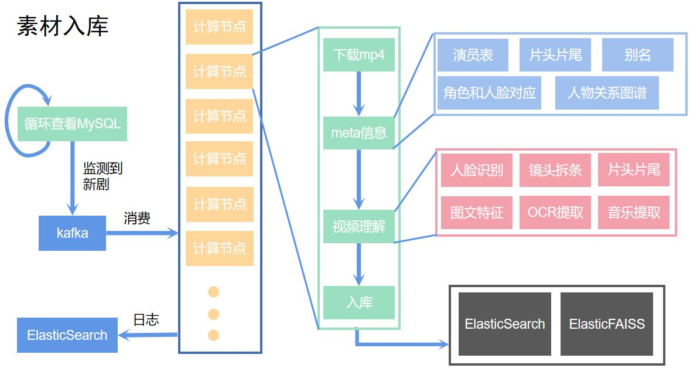

# Falong Shen
----
shenfalong@pku.edu.cn

## Projects
### Text2Video
**Input:** text or text with images 
**Output:** mp4
**What it does:**

输入一段文本, 在检索库中找到视频片段进行匹配, 最终输出一段mp4.

**Flowchart**

**Example**

### MusicVideo
**Input:** mp3

**Output:** mp4

**What it does:**

用户输入自己唱的一首歌, 算法配上视频得到MV.

**Flowchart**

核心算法和Text2video类似, 区别是前置模块有语音识别.

**Example: **

### AutoLabel
**Input:** partially human annotation
**Output:** fully annotation
**What it does:** 提高标注人员的标注效率.  原理是利用有些标注样本容易, 可以进行过滤.

**Flowchart**

### StyleTransfer
**Input:**  camera video image

**Output:** stylish video image

**What it does:**

**Flowchart**

**Example: **

## Publications

**Falong Shen**, Gang Zeng. *Semantic Image Segmentation via Guidance of Image Classification*. Journal of Neurocomputing 2018.  

**Falong Shen**, Gang Zeng. *Gaussian Dilated Convolution for Semantic Image Segmentation* Pacific-Rim Conference on Multimedia (PCM), 2018. oral. 

 **Falong Shen**, Shuicheng Yan, Gang Zeng. *Neural Style Transfer via Meta Neworks.* IEEE Conference on Computer Vision and Pattern Recognition (CVPR), 2018. 

**Falong Shen**, Rui Gan, Shuicheng Yan, Gang Zeng. *Semantic Segmentation via Structured Patch Prediction, Context CRF and Guidance CRF.* IEEE Conference on Computer Vision and Pattern Recognition (CVPR)}, 2017. 

**Falong Shen**, Rui Gan. *Joint segmentation and classification with fully convolutional networks.* International Conference on Systems and Informatics (ICSAI), 2016. 

**Falong Shen**, Rui Gan, Gang Zeng. *Weighted residuals for very deep networks.* International Conference on Systems and Informatics (ICSAI)}, \textbf{2016}. 

**Falong Shen**, JiYuan Zhang, Rui Gan, Jingdong Wang, Gang Zeng. *Layered Contextual Model For Face Alignment With Group Sparse Feature.* The 3rd IAPR Asian Conference on Pattern Recognition (ACPR)}, 2015.

JiYuan Zhang, Rui Gan, Gang Zeng, **Falong Shen**,  Hongbin Zha. *Trajectory-based Stereo Visual Odometry with Statistical Outlier Rejection.* The 3rd IAPR Asian Conference on Pattern Recognition (ACPR), 2015.

**申发龙**, 张进江. *单轴压缩剪应变局部化带分布的数值模拟及其对最大有效力矩准则的验证*. 北京大学学报(自然科学版), 2013.
